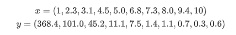

## Herramientas
La idea de las herramientas computacionales es facilitar cálculos que serían muy complejos o tediosos de hacer a mano. Además nos proporcionan la opción de graficar de manera precisa nuestros datos y ver cómo se comportan.

En esta guía básica veremos cómo utilizar 3 herramientas distintas:

  * Excel
  * Python
  * Octave

Para el caso de MATLAB ya existe una guía que estará disponible

Para cáda software haremos la misma tarea:
Dado un set de datos  donde los  corresponden a nuestra variable independiente (por ejemplo el tiempo) y nuestros  son la variable dependiente (por ejemplo el voltaje).

Más concretamente usaremos los siguientes datos:

Usaremos estos datos para operar vectores con escalares.

Cada uno de nuestros datos se puede ver como un vector  donde . En nuestro caso 

A su vez todos los datos de  se pueden ver como un vector, tal como presentamos los datos anteriormente. Lo mismo es válido para los datos . La gracia de esto es que ahora los podemos trabajar como todos los datos para la variable independiente por un lado, y todos los datos para la variable dependiente por otro.

Por lo general queremos trabajar los datos de la variable intependiente. Por lo que en este documento haremos lo siguiente:

  + Primero vamos a definir las variables según cada programa
  + Multiplicaremos la variable independiente por un escalar 3.14
  + Haremos un gráfico

Estos pasos los haremos en todos los programas
