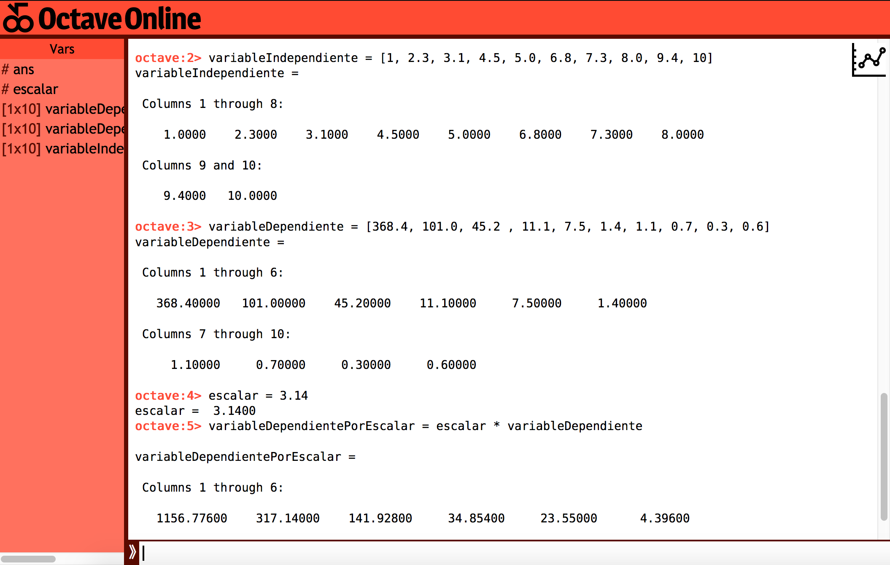

### Octave
#### Vector por escalar
Octave es un lenguaje de programación open source para la operación de matrices, lo puede usar online [acá](https://octave-online.net/) pero también existe una versión instalable. Si no quieren hacer una cuenta (como es mi caso) pueden, en vez de hacer un script, ejecutar los comandos uno a uno.

Es bastante similar a python pero acá no vamos a tener que importar nada.

primero podemos derechamente definir los vectores


```octave
variableIndependiente = [1, 2.3, 3.1, 4.5, 5.0, 6.8, 7.3, 8.0, 9.4, 10]
variableDependiente = [368.4, 101.0, 45.2 , 11.1, 7.5, 1.4, 1.1, 0.7, 0.3, 0.6]
```

de igual manera que en python, podemos crear una variable que represente el escalares

```octave
escalar = 3.14
```

y de igual manera la multiplicación

```octave
variableDependientePorEscalar = escalar * variableDependiente
```

A medida que van ingresando las variables, debería verse algo así:



#### Graficando

Para graficar, de manera similar a python, tenemos el siguiente código


```octave
plot(variableIndependiente, variableDependiente, '.')
title('Gráfico')
xlabel('variable independiente')
ylabel('variable dependiente')
grid()
```

finalmente para guardar el gráfico solo tenemos que dar botón secundario en la imagen y guardar como:


