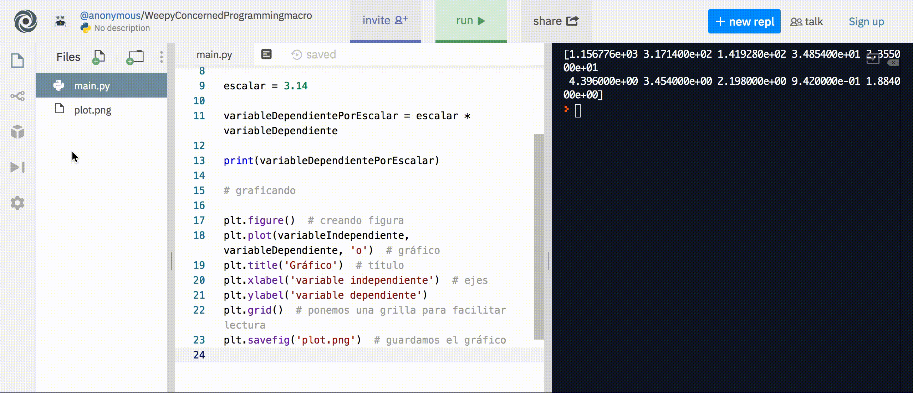

### Python
#### Vector por escalar
Python es un lenguaje multipropósito interpretado open source que funciona muy bien para análisis matemático. En caso que no tenga instalado Python en su ordenador, usaremos el siguiente link. Si tiene Python 3.7 o superior estas instrucciones deberían servirle sin problemas. Se asume que usted tiene instalados los paquetes numpy y matplotlib.

Primero que nada en python hay que importar lo que queremos usar, en este caso numpy para las operaciones y matplotlib.pyplot para graficar


```python
import numpy as np
import matplotlib.pyplot as plt
```

Si estás usando replt.it en vez del bloque anterior tiene que usar

```python
import matplotlib as mpl
mpl.use('Agg')
import numpy as np
import matplotlib.pyplot as plt
```
una vez importado los paquetes podemos, en el mismo archivo escribir los vectores

```python
variableIndependiente = np.array([1, 2.3, 3.1, 4.5, 5.0, 6.8, 7.3, 8.0, 9.4, 10])
variableDependiente = np.array([368.4, 101.0, 45.2 , 11.1, 7.5, 1.4, 1.1, 0.7, 0.3, 0.6])
```

para multiplicar por el escalar, definimos una variable para este

```python
escalar = 3.14
```

finalmente multiplicamos usando el operador multiplicación representado por 

```python
variableDependientePorEscalar = escalar * variableDependiente
```

ahora si revisamos la variableDependientePorEscalar deberíamos obtener el vector

#### Graficando

para graficar tenemos que primero creamos la figura y añadimos todas las partes línea a línea

```python
plt.figure()  # creando figura
plt.plot(variableIndependiente, variableDependiente, 'o')  # gráfico
plt.title('Gráfico')  # título
plt.xlabel('variable independiente')  # ejes
plt.ylabel('variable dependiente')
plt.grid()  # ponemos una grilla para facilitar lectura
plt.savefig('plot.png')  # guardamos el gráfico
```

si están en repl.it les va a aparecer el gráfico en la barra lateral izquierda, de donde lo pueden descargar.
Si por otro lado lo ejecutó en su computador, entonces la salida va a estar en su carpeta de trabajo



[Acá](https://repl.it/repls/WeepyConcernedProgrammingmacro?lite=true)  pueden ejecutar el código usado. También está disponible en la carpeta ``archivos->python`` de este repositorio


#### Importando datos en Python

Para importar datos en python necesitamos la librería ``numpy`` y de esta librería vamos a necesitar la función ``genfromtxt``, asumiendo que nuestros datos se encuentran en la misma carpeta donde estamos trabajando, y que se llaman ``datos.csv``(pueden tener cualquier otro nombre incluso pueden terminar en ``.txt`` con tal que cumpla el formato ``csv``)

```python
import numpy as np
data = np.genfromtxt('datos.csv', delimiter=',', skip_header=1)
```
Con el parámetro ``delimiter`` estamos diciendo que lo que separa nuestros datos son comas y como los datos suelen venir con la primera fila siendo los nombres de las variables, ponemos el parámetro ``skip_header=1`` que nos dice que nos saltemos la primera línea ya que no son datos numéricos.

Si además quieren separar las dos columnas que tiene el archivo de datos (puede tener más, per en el ejemplo de abajo hay dos), pueden usar la notación de unpacking de Python de la siguiente manera

```python
x, y = data.T
```

Se transpone ya que la primera dimensión del arreglo es el número de datos y la segunda es las columnas, pero queremos que ``x`` e ``y`` sean las columnas, por lo que debemos transponer el arreglo.


El ejemplo al que se hace referencia se puede encontrar en el siguiente [enlace](https://repl.it/@TomasRojas2/Importando-datos-con-Python)
