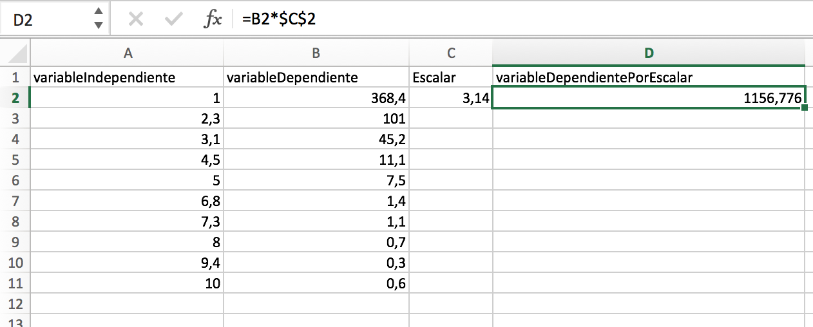
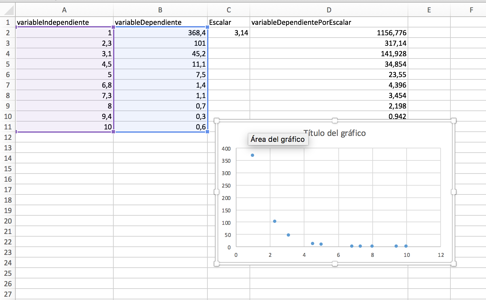

# Métodos experimentales

Este instructivo tiene por propósito ayudarlos a escoger herramientas computacionales para el curso _Métodos experimentales_

## Herramientas
La idea de las herramientas computacionales es facilitar cálculos que serían muy complejos o tediosos de hacer a mano. Además nos proporcionan la opción de graficar de manera precisa nuestros datos y ver cómo se comportan.

En esta guía básica veremos cómo utilizar 3 herramientas distintas:

  * Excel
  * Python
  * Octave

Para el caso de MATLAB ya existe una guía que estará disponible

Para cáda software haremos la misma tarea:
Dado un set de datos  donde los  corresponden a nuestra variable independiente (por ejemplo el tiempo) y nuestros  son la variable dependiente (por ejemplo el voltaje).

Más concretamente usaremos los siguientes datos:


Usaremos estos datos para operar vectores con escalares.

Cada uno de nuestros datos se puede ver como un vector  donde . En nuestro caso 

A su vez todos los datos de  se pueden ver como un vector, tal como presentamos los datos anteriormente. Lo mismo es válido para los datos . La gracia de esto es que ahora los podemos trabajar como todos los datos para la variable independiente por un lado, y todos los datos para la variable dependiente por otro.

Por lo general queremos trabajar los datos de la variable intependiente. Por lo que en este documento haremos lo siguiente:

  + Primero vamos a definir las variables según cada programa
  + Multiplicaremos la variable independiente por un escalar 3.14
  + Haremos un gráfico

Estos pasos los haremos en todos los programas


### Excel
#### Vector por escalar
Excel es un programa de pago de la empresa Microsoft, consiste en una _hoja de cálculo_ donde se puede representar un vector como una columna:


Si se fijan, hay algunos números que aparecen al lado izquierdo y otros al lado derecho. Dependiendo de la configuración en excel, la separación de decimales va a ser o bien una coma o bien un punto. En sistemas en español suele venir como una coma, por lo que si queremos que excel entienda esos números, tenemos que cambiar los puntos por comas.


Vemos que ahora todos nuestro números están alineados a la derecha, este es el comportamiento que esperamos.


Ahora vamos a multiplicar la columna de variable independiente por 3.14. Para esto, primero hagamos que una celda tenga ese valor. Una vez hecho eso, creamos una nueva columna donde vamos a multiplicar la variable dependiente por el escalar y en la primera fila de la columna introducimos el siguiente texto: '=CPVD*$LCE$NCE' donde CPVD es la celda de la primera variable dependiente, LCE la letra de la celda del escalar y NCE es el número de la celda del escalar.



Una vez hecho eso, presione la tecla 'enter' y deberia aparecer el primer resultado como en la imágen anterior.

Ahora arrastre el punto verde de la primera celda de la columna de la multiplicacion del escalar con la variable dependiente


#### Graficando

Para graficar los resultados excel tiene botones rápidos. Primero sosteniendo la tecla Ctrl en Windows o cmd en Mac seleccionamos las dos columnas que queremos graficar juntas, siempre primero seleccionamos la variable independiente y luego la dependiente.


Una vez seleccionado vaya al menú insetar en las pestañas superiores, sobreponga su cursor en el botón de gráfico con puntos y seleccione dispersión


Al hacer click debería aparecerles un gráfico automático.



Ahora puede agregar los títulos de los ejes de la siguiente manera:
Primero seleccione el gráfico y vaya a _Diseño de gráfico_, luego _Agregar elemento de gráfico -> títulos de los ejes_ y marque ambos


Ahora pueden cambiar tanto el título del gráfico como las etiquetas, dando doble click y escribiendo los nuevos títulos.

#### Importando datos en Excel

Lo primero que hacemos es abrir un nuevo archivo de Excel en blanco, luego hacemos click en ``Archivo>Importar`` y en la ventana que aparece seleccione ``Archivo de texto``


Luego de esto les aparecerá una ventana donde tienen que selesccionar el archivo con los datos a importar. Luego aparecerá otra ventana en donde debe hecer click en ``Finalizar``.


Con eso deberían tener los datos de esta manera


### Python
#### Vector por escalar
Python es un lenguaje multipropósito interpretado open source que funciona muy bien para análisis matemático. En caso que no tenga instalado Python en su ordenador, usaremos el siguiente link. Si tiene Python 3.7 o superior estas instrucciones deberían servirle sin problemas. Se asume que usted tiene instalados los paquetes numpy y matplotlib.

Primero que nada en python hay que importar lo que queremos usar, en este caso numpy para las operaciones y matplotlib.pyplot para graficar


```python
import numpy as np
import matplotlib.pyplot as plt
```

Si estás usando replt.it en vez del bloque anterior tiene que usar

```python
import matplotlib as mpl
mpl.use('Agg')
import numpy as np
import matplotlib.pyplot as plt
```
una vez importado los paquetes podemos, en el mismo archivo escribir los vectores

```python
variableIndependiente = np.array([1, 2.3, 3.1, 4.5, 5.0, 6.8, 7.3, 8.0, 9.4, 10])
variableDependiente = np.array([368.4, 101.0, 45.2 , 11.1, 7.5, 1.4, 1.1, 0.7, 0.3, 0.6])
```

para multiplicar por el escalar, definimos una variable para este

```python
escalar = 3.14
```

finalmente multiplicamos usando el operador multiplicación representado por 

```python
variableDependientePorEscalar = escalar * variableDependiente
```

ahora si revisamos la variableDependientePorEscalar deberíamos obtener el vector

#### Graficando

para graficar tenemos que primero creamos la figura y añadimos todas las partes línea a línea

```python
plt.figure()  # creando figura
plt.plot(variableIndependiente, variableDependiente, 'o')  # gráfico
plt.title('Gráfico')  # título
plt.xlabel('variable independiente')  # ejes
plt.ylabel('variable dependiente')
plt.grid()  # ponemos una grilla para facilitar lectura
plt.savefig('plot.png')  # guardamos el gráfico
```

si están en repl.it les va a aparecer el gráfico en la barra lateral izquierda, de donde lo pueden descargar.
Si por otro lado lo ejecutó en su computador, entonces la salida va a estar en su carpeta de trabajo


[Acá](https://repl.it/repls/WeepyConcernedProgrammingmacro?lite=true)  pueden ejecutar el código usado. También está disponible en la carpeta ``archivos->python`` de este repositorio


#### Importando datos en Python

Para importar datos en python necesitamos la librería ``numpy`` y de esta librería vamos a necesitar la función ``genfromtxt``, asumiendo que nuestros datos se encuentran en la misma carpeta donde estamos trabajando, y que se llaman ``datos.csv``(pueden tener cualquier otro nombre incluso pueden terminar en ``.txt`` con tal que cumpla el formato ``csv``)

```python
import numpy as np
data = np.genfromtxt('datos.csv', delimiter=',', skip_header=1)
```
Con el parámetro ``delimiter`` estamos diciendo que lo que separa nuestros datos son comas y como los datos suelen venir con la primera fila siendo los nombres de las variables, ponemos el parámetro ``skip_header=1`` que nos dice que nos saltemos la primera línea ya que no son datos numéricos.

Si además quieren separar las dos columnas que tiene el archivo de datos (puede tener más, per en el ejemplo de abajo hay dos), pueden usar la notación de unpacking de Python de la siguiente manera

```python
x, y = data.T
```

Se transpone ya que la primera dimensión del arreglo es el número de datos y la segunda es las columnas, pero queremos que ``x`` e ``y`` sean las columnas, por lo que debemos transponer el arreglo.


El ejemplo al que se hace referencia se puede encontrar en el siguiente [enlace](https://repl.it/@TomasRojas2/Importando-datos-con-Python)

### Octave
#### Vector por escalar
Octave es un lenguaje de programación open source para la operación de matrices, lo puede usar online [acá](https://octave-online.net/) pero también existe una versión instalable. Si no quieren hacer una cuenta (como es mi caso) pueden, en vez de hacer un script, ejecutar los comandos uno a uno.

Es bastante similar a python pero acá no vamos a tener que importar nada.

primero podemos derechamente definir los vectores


```octave
variableIndependiente = [1, 2.3, 3.1, 4.5, 5.0, 6.8, 7.3, 8.0, 9.4, 10]
variableDependiente = [368.4, 101.0, 45.2 , 11.1, 7.5, 1.4, 1.1, 0.7, 0.3, 0.6]
```

de igual manera que en python, podemos crear una variable que represente el escalares

```octave
escalar = 3.14
```

y de igual manera la multiplicación

```octave
variableDependientePorEscalar = escalar * variableDependiente
```

A medida que van ingresando las variables, debería verse algo así:


#### Graficando

Para graficar, de manera similar a python, tenemos el siguiente código


```octave
plot(variableIndependiente, variableDependiente, '.')
title('Gráfico')
xlabel('variable independiente')
ylabel('variable dependiente')
grid()
```

finalmente para guardar el gráfico solo tenemos que dar botón secundario en la imagen y guardar como:


### LTSpice

En este semestre, dada la modalidad online, estamos usando LTSpice. Por lo mismo, en esta sección se dedica un poco de tiempo a esta herramienta.


#### Exportando desde LTSpice

Para exportar los datos desde LTSpice, tienen que, una vez hecho su gráfico, tienen que apretar botón secundario en el gráfico y hacer click en ``File>Export data as text``, va a aparecer una ventana en donde deben especificar dónde va a ser guardado y además con qué nombre. Por defecto usa una carpeta de LTSpice. Aquí no se cambió pero se sugiere hacerlo para que esté en una carpeta que sepan llegar con facilidad usando el botón ``Browse``.


Deberán terminar con un archivo como el que se ve a continuación:


```
time	I(R1)
0.000000000000000e+000	1.200000e-002
1.950621068105102e+001	1.200000e-002
1.999449193105102e+001	1.200000e-002
2.000000000000000e+001	1.200000e-002
```

## Archivos de ejemplos

Para descargar los archivos de ejemplos puedes ir a [esta página](https://github.com/tomasrojasc/MetodosExperimentalesOnline/tree/master/docs)

## Indicaciones

Cualquier duda favor consultar a sus respectivs auxiliars. Si encuentra un error en esta guía favor informar.
